# Varsity Mart
A full stack site for a loyalty program. Users can create accounts, gain points, be promoted, host events, and more.

Each page has different functionalities based on a user's role, and users can switch to lower roles to view those features.

## Table of Contents
- [Live Link](#live-link)
- [Installation](#installation)
- [Site Pages](#site-pages)
- [Advanced Featues](#advanced-features)

# Live Link
https://csc309-a2-production.up.railway.app/

# Installation

Clone Github Project:
https://github.com/DimitriosGkiokmema/CSC309-A2.git

Install Dependencies:
cd backend
npm install
npx prisma generate
cd ../frontend/react-app
npm install

Create ENV Files
FRONTEND .env -> place in backend directory
VITE_IMAGEKIT_PUBLIC_KEY ='public_key'
VITE_IMAGEKIT_ENDPOINT='YOUR_ENDPOINT'
VITE_BACKEND_URL='http://localhost:3000'

BACKEND .env -> place in react-app directory
JWT_SECRET='SOME_LONG_STRING'
IMAGEKIT_PRIVATE_KEY='private_key'
IMAGEKIT_PUBLIC_KEY ='public_key'
IMAGEKIT_ENDPOINT='YOUR_ENDPOINT'
DATABASE_URL="YOUR_ENDPOINT"

Launch Site Locally
TERMINAL 1:
cd backend
node .\index.js 3000

TERMINAL 2:
cd ./frontend/react-app
npm run dev

That's it! There is no other setup required. While we do use external APIs and a cloud db, everything
you need is already in package.json and our .evn files. Follow the steps above and you should be able 
to run our site locally!

# Site Pages
**Landing Page**
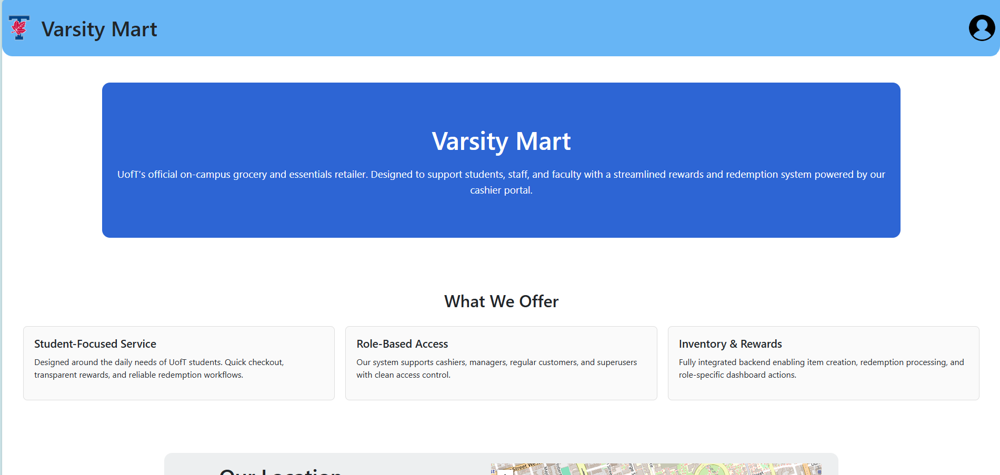
Upon loading the site, users can view information on Varsity Mart and log in.

**Navigation**
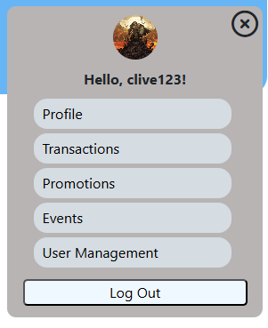
After logging in, users have access to the navigation dropdown, which lets them explore the site

**Profile Page**
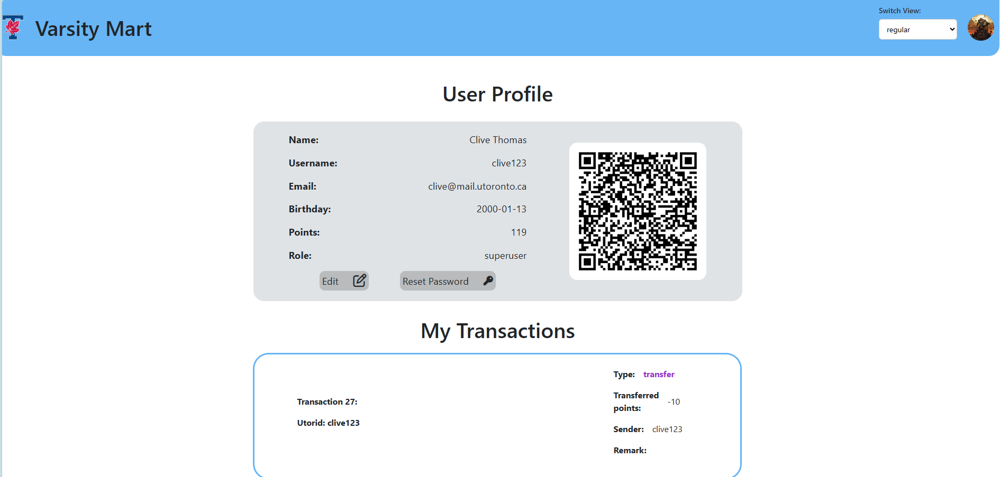
After logging in, users can view and update their information.

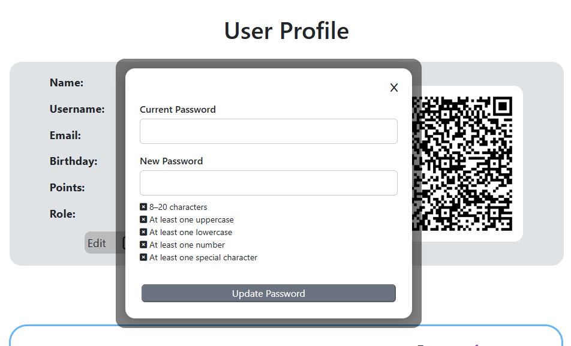
Users can update their password

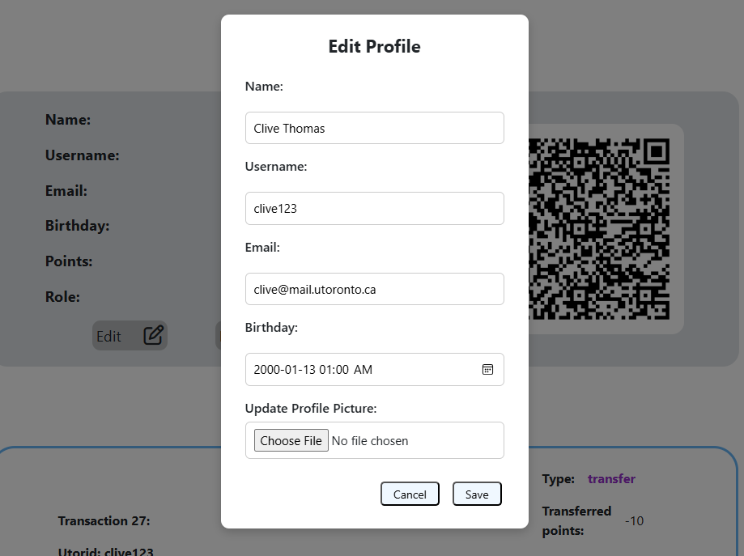
... as well as their info.

**Transactions Page**
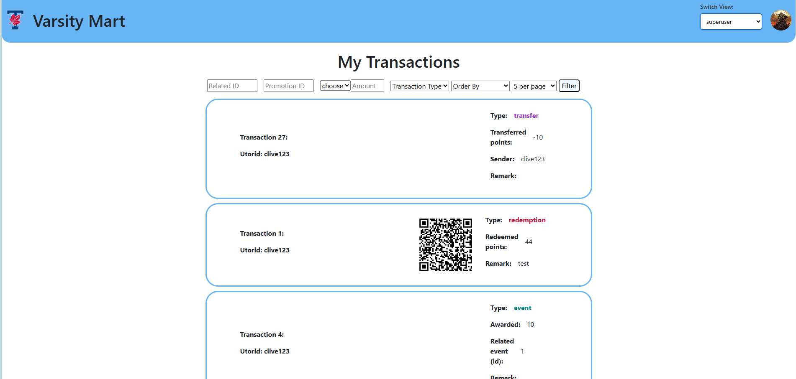
Users can search through transactions

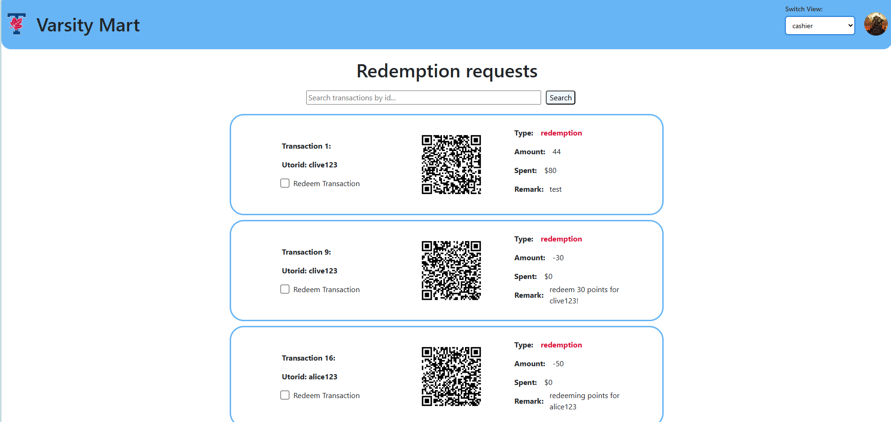
Cashiers can redeem transactions

**Promotions Page**
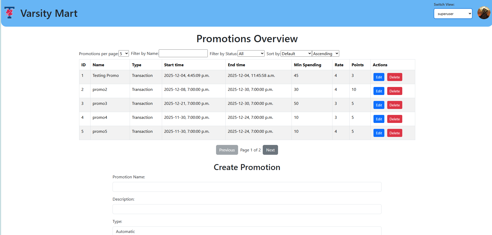
Users can view and create in-store promotions

**Events Page**

Users can search through all events in the database

**User Management Page**
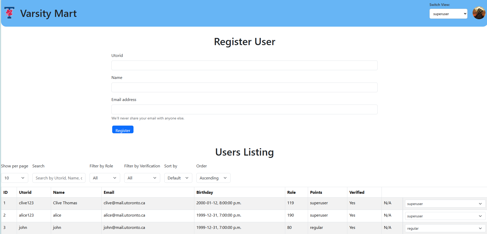
Users can register new users, or manage current users. If the role of the logged-in user is high enough, they can also promote, demote, or mark/unmark others as suspicious

# Advanced Features
**ImageKit API Integration**
We used an external api to allow users to upload pictures and have our site display them as their profile picture.

1. Users may upload a picture when updating their info (look at the profile page above!)
2. Once ImageKit stores a new image, it returns its url (which can literally be pasted on a browser to be looked at). This url is stored in the user's info in our database.
3. When a user logs in or updates their info, our site checks if said link exists in the user's data entry. If it exists, we display it. Otherwise, the site will show a default icon for the profile picture.

Here is some of the code that makes this possible:
1. We authenticate the request
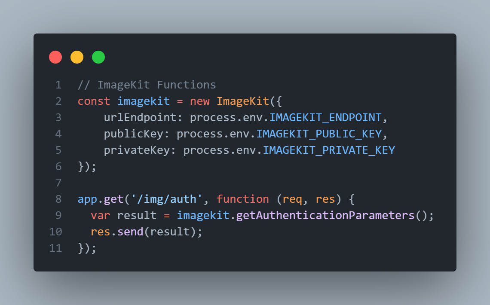
2. The returned url is stored on the database
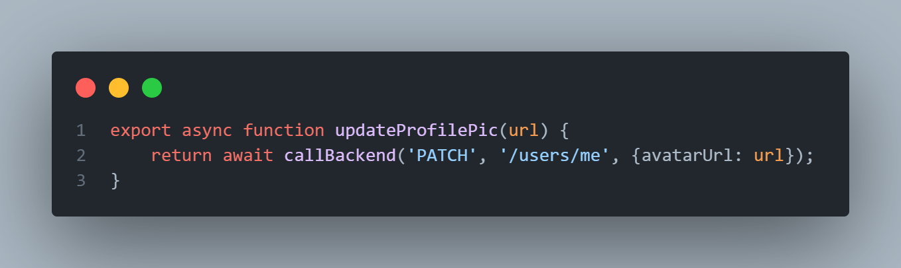
3. Our site determines if such a url exists, otherwise returns the default image
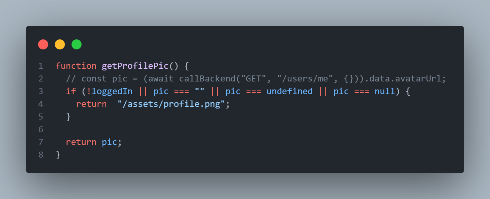
4. The user is then able to see their new image displayed on the site!

**External Database Usage**
We swapped our local .db file for an actual online database.
This allows us to manage the data separately from our site.

Accomplishing this required changing where our schema.prisma points to:
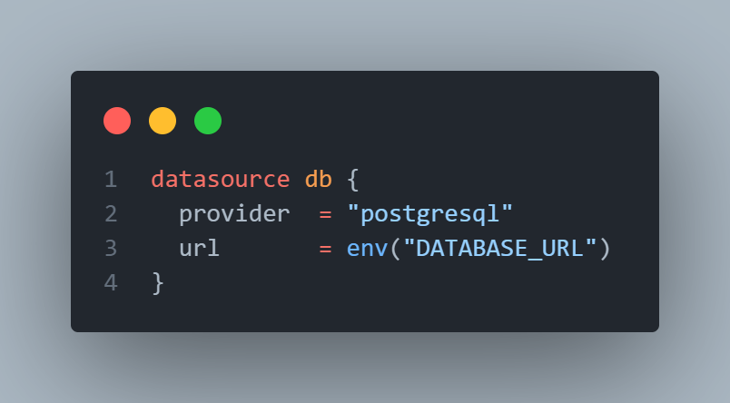

We still have the option to populate the db locally through seed.js, which is what we did.
